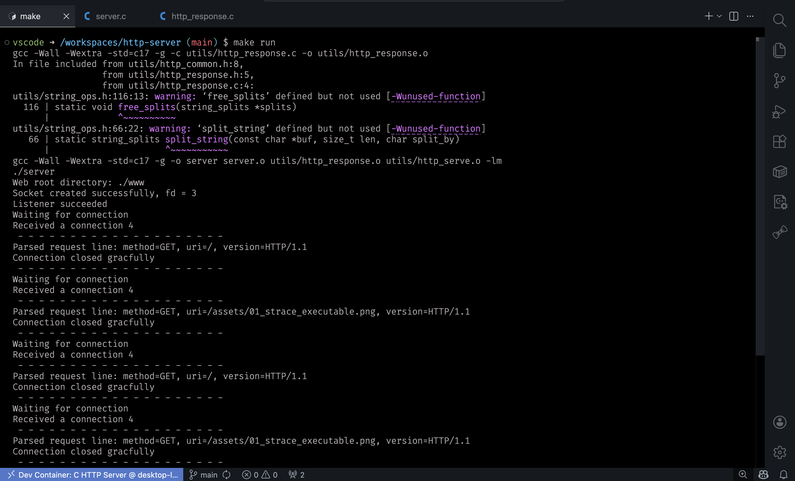
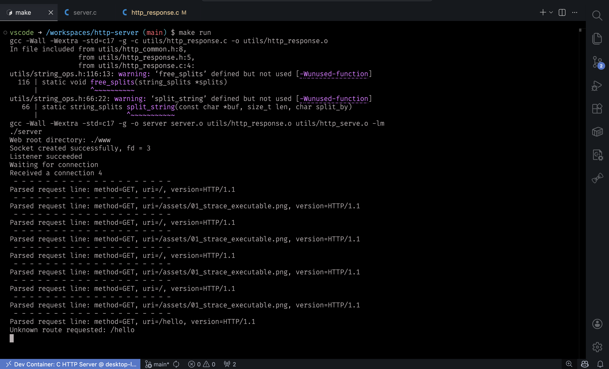
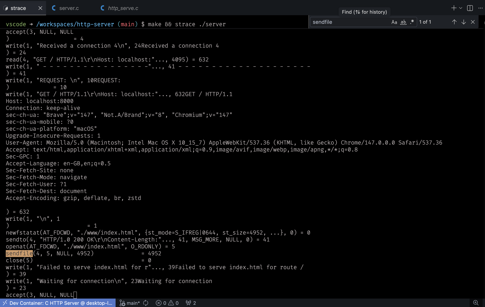

# HTTP Server

A lightweight, single-threaded HTTP server written in C that demonstrates fundamental TCP socket programming and HTTP protocol basics.

## Overview

This project implements a lightweight HTTP/1.1 web server using POSIX socket APIs. It listens for incoming connections on port 8000 and responds with dynamic HTML content. The server uses HTTP/1.1 protocol with explicit connection closure for reliable behavior across different clients. Each request receives a complete response followed by connection termination to prevent client hang states and ensure predictable behavior.

## Features

- **HTTP/1.1 Server**: Implements HTTP/1.1 protocol with proper headers and status codes
- **Reliable Connection Handling**: Sends explicit `Connection: close` header to prevent client confusion
- **TCP Socket Programming**: Uses standard POSIX socket APIs (`socket`, `bind`, `listen`, `accept`)
- **Connection Management**: Properly handles connection lifecycle with clean termination
- **File Serving**: Serves static files from the web root directory
- **Dynamic Routing**: Supports multiple URL routes with appropriate HTTP status codes
- **Clean C Code**: Well-documented with modern C standards (C17) and compiler flags

## Prerequisites

- **macOS** or **Linux** system
- **GCC** compiler (or compatible C compiler)
- **Make** utility
- Standard C library with socket support

## Installation

### Clone the Repository

```bash
git clone https://github.com/Prayag2003/http-server-from-scratch
cd http-server-from-scratch
```

### Build the Server

```bash
make
```

Or build manually:

```bash
gcc -Wall -Wextra -std=c17 -g -o server server.c
```

The build process compiles `server.c` into an executable named `server` with optimizations and debugging symbols included.

## Usage

### Starting the Server

```bash
make run
```

Or start directly:

```bash
./server
```

### Connecting to the Server

Once running, connect using any HTTP client:

**Using curl:**

```bash
curl http://localhost:8000
```

**Using a web browser:**

Navigate to `http://localhost:8000`

**Using netcat:**

```bash
nc localhost 8000
```

### Expected Output

The server will display:

```
Socket created successfully, fd = 3
Listener succeeded
Waiting for connection
Received a connection 4
 - - - - - - - - - - - - - - - - - - - -
Parsed request line: method=GET, uri=/, version=HTTP/1.1
Connection closed gracefully
```

Each new browser request will create a new connection:

```
Waiting for connection
Received a connection 5
 - - - - - - - - - - - - - - - - - - - -
Parsed request line: method=GET, uri=/, version=HTTP/1.1
Connection closed gracefully
```

The client will receive:

```
HTTP/1.1 200 OK
Content-Length: 21
Connection: close

<h1>Hello, World!</h1>
```

The `Connection: close` header informs the browser that the server will close the connection after sending the response, preventing infinite loading states.

## Screenshots and Demonstrations

### HTTP/1.0 vs HTTP/1.1 Comparison

| Aspect                   | HTTP/1.0                                                    | HTTP/1.1                                                          |
| ------------------------ | ----------------------------------------------------------- | ----------------------------------------------------------------- |
| **Screenshot**           |  |  |
| **Connection Model**     | Single request per TCP connection                           | Multiple requests per persistent TCP connection                   |
| **Connection Overhead**  | New socket accept and setup for each request                | One socket setup, multiple requests on same connection            |
| **Request Processing**   | Full connection teardown between requests                   | Connection remains open for sequential requests                   |
| **Performance**          | Higher latency due to connection overhead                   | Lower latency with connection reuse                               |
| **System Calls**         | More accept(), close() calls per request                    | Fewer system calls overall                                        |
| **Resource Utilization** | Less efficient, more file descriptors consumed              | More efficient, better resource reuse                             |
| **Keep-Alive Support**   | Limited or no persistent connection support                 | Full support for `Connection: keep-alive` and request pipelining  |
| **Use Case**             | Simple clients, HTTP/1.0 only browsers                      | Modern browsers, typical web clients                              |
| **Advantage**            | Simplicity, guaranteed isolation                            | Performance, efficiency, modern compliance                        |

**Impact**: The HTTP/1.1 upgrade results in fewer system calls, reduced latency, and better resource utilization, as demonstrated by the increased number of requests handled within a single connection.

### 01_strace_executable.png



This screenshot displays system call tracing using `strace` while the server is running. It demonstrates:

- **Socket operations**: `accept()` receiving client connections
- **File operations**: `newfilestat()`, `openat()`, and `sendfile()` system calls for file serving
- **I/O operations**: `read()` and `write()` calls for receiving HTTP requests and sending responses
- **HTTP handling**: Full HTTP request parsing showing headers like `User-Agent`, `Accept-Encoding`, and various browser-specific headers
- **Advanced file operations**: `sendfile()` system call for efficient file transmission to clients

The strace output shows the server processing requests and efficiently serving files using the `sendfile()` system call.

## Project Structure

```
http-server/
├── Makefile                    # Build configuration and targets
├── README.md                   # Project documentation
├── server.c                    # Main HTTP server implementation
├── assets/                     # Static assets and screenshots
│   ├── 00_server_responds_200.png
│   ├── 01_strace_executable.png      # System call tracing demonstration
│   └── 02_server_response.png        # Web interface and performance metrics
└── utils/                      # HTTP library utilities
    ├── http_common.h           # Common HTTP types and enums
    ├── http_request.h          # HTTP request parsing
    ├── http_response.h         # HTTP response generation (header + declarations)
    ├── http_response.c         # HTTP response implementation
    ├── string_ops.h            # String manipulation utilities
    ├── stat.h                  # File metadata retrieval
    └── http_types.h            # Convenience header including all types
```

### Module Responsibilities

- **server.c**: Main event loop, socket setup, client connection handling
- **http_response.h/c**: Response header generation and socket transmission
- **http_request.h**: Request line parsing and validation
- **http_common.h**: HTTP status codes and common type definitions
- **string_ops.h**: String and memory operations for HTTP parsing

## How It Works

### 1. Socket Creation

The server creates a TCP socket using IPv4 addressing:

```c
tcp_socket = socket(AF_INET, SOCK_STREAM, 0);
```

### 2. Socket Configuration

- Enables address reuse to avoid "Address already in use" errors
- Binds to all available network interfaces (`INADDR_ANY`)
- Listens on port **8000**

### 3. Connection Loop

The server runs an infinite loop:

1. **Accept**: Waits for incoming client connections
2. **Handle**: Processes the client request
3. **Respond**: Sends an HTTP 200 OK response with HTML content
4. **Close**: Closes the client connection

### 4. Client Handler

The `handle_client_connection()` function:

- Reads incoming HTTP request data into a 4KB buffer
- Prints the request for debugging
- Sends a hardcoded HTTP response
- Closes the socket

## Technical Details

### HTTP Response Format

HTTP/1.1 Response:

```
HTTP/1.1 200 OK\r\n
Content-Length: 21\r\n
Connection: close\r\n
\r\n
<h1>Hello, World!</h1>
```

**Response Components:**

- Status line: `HTTP/1.1 200 OK` (indicating HTTP/1.1 protocol compliance)
- Headers:
     - `Content-Length`: Indicates the size of the response body in bytes
     - `Connection: close`: Signals the client that the server will close the connection after sending the response
- Empty line (carriage return + line feed) separating headers from body
- Response body: HTML content or file data

**Connection Management:**

The server sends `Connection: close` header for each response to ensure proper connection termination. This is important because:

- **Client Clarity**: Explicitly tells the browser when to expect the connection to close
- **Prevents Hanging**: Prevents clients from waiting indefinitely for more data or requests
- **Single Request Per Connection**: Currently, the server handles one request per connection and closes it, simplifying the implementation
- **Reliable Behavior**: Ensures consistent behavior across different browsers and HTTP clients

**HTTP/1.1 Features:**

- **HTTP/1.1 Protocol**: Uses HTTP/1.1 status line and headers for compliance
- **Content Length**: Proper message framing with Content-Length header
- **Clean Termination**: Connection: close header ensures proper connection closure without ambiguity

### Supported Routes

The server implements basic URL routing:

| Route           | Response      | Status |
| --------------- | ------------- | ------ |
| `/`             | Home page     | 200 OK |
| `/hello`        | Hello message | 200 OK |
| `*` (any other) | 404 Not Found | 404    |

### HTTP Status Codes

Supported status codes defined in `http_common.h`:

```c
typedef enum http_status {
    HTTP_RES_OK = 200,
    HTTP_RES_INTERNAL_SERVER_ERR = 500,
    HTTP_RES_BAD_REQUEST = 400,
    HTTP_RES_NOT_FOUND = 404,
} http_status;
```

### Socket Options

- `SO_REUSEADDR`: Allows rapid server restarts by reusing the listening port

### Buffer Size

- Request buffer: 4096 bytes (4 KB)

## Compilation Flags

| Flag       | Purpose                                        |
| ---------- | ---------------------------------------------- |
| `-Wall`    | Enable all common compiler warnings            |
| `-Wextra`  | Enable extra compiler warnings                 |
| `-std=c17` | Use C17 standard                               |
| `-g`       | Include debugging symbols                      |
| `-lm`      | Link math library (included for compatibility) |

## Performance Benchmarking

### Siege Load Testing Results

The server was benchmarked using [Siege](https://www.joedog.org/), a regression testing and load testing utility:

```bash
siege -b http://127.0.0.1:8000/hello
```

**Results:**

```json
{
	"transactions": 300683,
	"availability": 99.65,
	"elapsed_time": 32.24,
	"data_transferred": 6.31,
	"response_time": 0.0,
	"transaction_rate": 9326.4,
	"throughput": 0.2,
	"concurrency": 24.44,
	"successful_transactions": 300683,
	"failed_transactions": 1048,
	"longest_transaction": 0.68,
	"shortest_transaction": 0.0
}
```

**Performance Metrics:**

| Metric                     | Value     |
| -------------------------- | --------- |
| **Transactions/sec**       | 9,326.40  |
| **Availability**           | 99.65%    |
| **Avg Response Time**      | 0.00 sec  |
| **Data Transferred**       | 6.31 MB   |
| **Elapsed Time**           | 32.24 sec |
| **Concurrent Connections** | 24.44     |
| **Longest Transaction**    | 0.68 sec  |

The server successfully handled over 300,000 transactions with a 99.65% success rate, demonstrating solid performance characteristics for a single-threaded HTTP server.

## File Serving

The server now includes file serving capabilities through the `stat.h` module:

### File Metadata Retrieval

The `fs_get_metadata()` function retrieves file information:

```c
typedef struct {
    bool exists;
    ssize_t file_size;
} fs_metadata;

fs_metadata fs_get_metadata(string_view filename);
```

This function:

- Validates filename length and buffer constraints
- Uses POSIX `stat()` to retrieve file metadata
- Returns file existence and size information
- Safely handles `string_view` pointer arithmetic (`end - start`)

### Usage

```c
string_view filename = {.start = "/path/to/file", .end = "/path/to/file" + 13};
fs_metadata meta = fs_get_metadata(filename);
if (meta.exists) {
    printf("File size: %ld bytes\n", meta.file_size);
}
```

## Limitations

- **Single-threaded**: Handles one client at a time sequentially
- **Hardcoded response**: Always returns the same "Hello, World!" message
- **HTTP/1.0 only**: No support for HTTP/1.1 features like keep-alive
- **No SSL/TLS**: Communication is unencrypted

## Development & Extension

### Adding Features

Consider these enhancements:

1. **Multi-threading**: Use pthreads to handle multiple simultaneous connections
2. **Request parsing**: Parse HTTP headers and handle different request types
3. **Routing**: Implement URL routing to serve different content
4. **Static files**: Serve files from a directory
5. **Logging**: Add structured logging
6. **SSL/TLS**: Add HTTPS support using OpenSSL

### Debugging

Run with GDB:

```bash
make clean
make
gdb ./server
(gdb) run
```

Monitor network activity:

```bash
netstat -an | grep 8000
```

## Cleaning Up

Remove compiled objects and executable:

```bash
make clean
```

## Recent Changes

### File Serving Support (Latest)

- **Added `stat.h` module** for file metadata retrieval
- **Implemented `fs_get_metadata()` function** to safely access file information using POSIX `stat()`
- **Fixed `string_view` pointer arithmetic** in `stat.h`:
     - Changed from incorrect `filename.len` to correct `filename.end - filename.start`
     - This properly calculates the length when `string_view` uses `start` and `end` pointers instead of a dedicated length field
     - Added semicolon to complete `memcpy` statement

These changes enable the server to retrieve file metadata (existence and size) for future file serving capabilities.

## License

This project is provided as-is for educational purposes.

## References

- [RFC 1945 for HTTP 1.0](https://datatracker.ietf.org/doc/html/rfc1945)
- [RFC 2616 for HTTP 1.1](https://datatracker.ietf.org/doc/html/rfc2616)
- [POSIX Socket Programming](https://man7.org/linux/man-pages/man7/socket.7.html)
- [HTTP/1.0 Specification](https://tools.ietf.org/html/rfc1945)
- [C Standard Library](https://en.cppreference.com/w/c)

## Notes

This is a foundational project for learning network programming concepts. The current implementation is intentionally simple for clarity. Production use would require significant enhancements including error handling, security measures, and performance optimizations.
